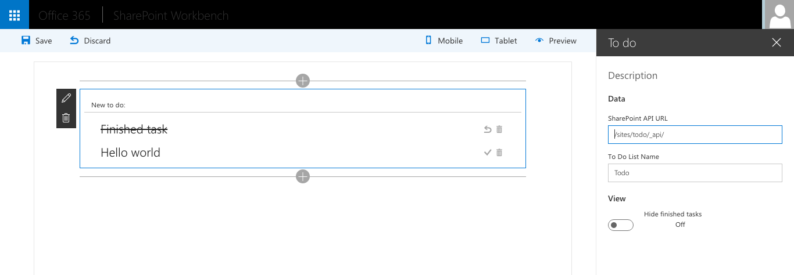

# To do Client-Side Web Part

Sample Web Part illustrating using Angular and [ngOfficeUIFabric](http://ngofficeuifabric.com) with the SharePoint Framework.

## Prerequisites
- SharePoint Online tenant
- Site Collection created under the **/sites/** Managed Path

## Minimal Path to Awesome

- clone this repo
- `$ npm i`
- `$ tsd install`
- `$ gulp serve --nobrowser`
- in your SharePoint Site create a Tasks list
- from the **./temp** folder copy the **workbench.html** file, rename it to **workbench.aspx** and upload to a Document Library in the same SharePoint Site as where the Tasks list is located.
_Note: you will get an error if you try to upload an .aspx file to a Document Library in the Root Site Collection. Instead you should use a Site Collection located under the **/sites/** Managed Path_
- navigate to the workbench page uploaded to your SharePoint site, ie. _https://contoso.sharepoint.com/sites/todo/documents/workbench.aspx_
- add the Web Part to canvas and in its configuration specify:
  - server-relative REST API URL, eg: **/sites/todo/_api/**
  - name of the Tasks lists where to do items are stored, eg. **Todo**

## Features

The To do Web Part is a sample Client-Side Web Part built on the SharePoint Framework built using Angular and ngOfficeUIFabric.

This Web Part illustrates the following concepts on top of the SharePoint Framework:

- using Angular v1.x with TypeScript for building SharePoint Framework Client-Side Web Parts
- using ngOfficeUIFabric for styling Angular v1.x Client-Side Web Parts
- loading Angular and ngOfficeUIFabric from CDN
- using a newer version of Office UI Fabric for styling Client-Side Web Parts
- loading CSS stylesheets from CDN
- communicating with SharePoint using the SharePoint REST API
- performing CRUD operations on SharePoint List Items from Angular using the SharePoint REST API
- using non-reactive Web Part Property Pane
- using conditional rendering for one-time Web Part setup
- passing Web Part configuration to Angular and reacting to configuration changes